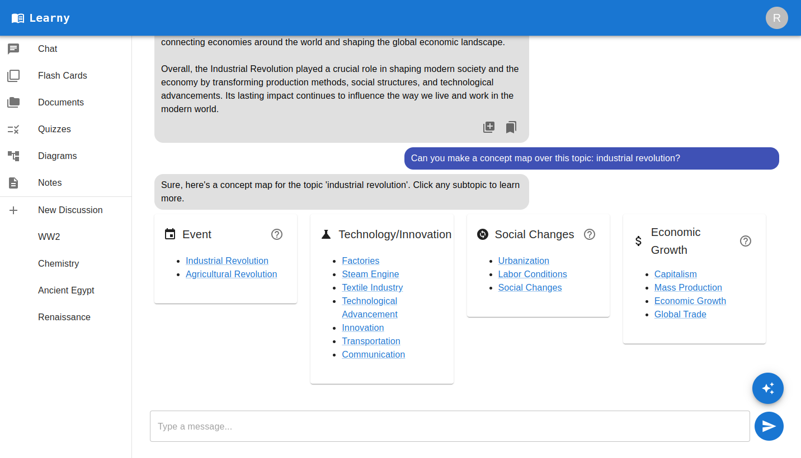
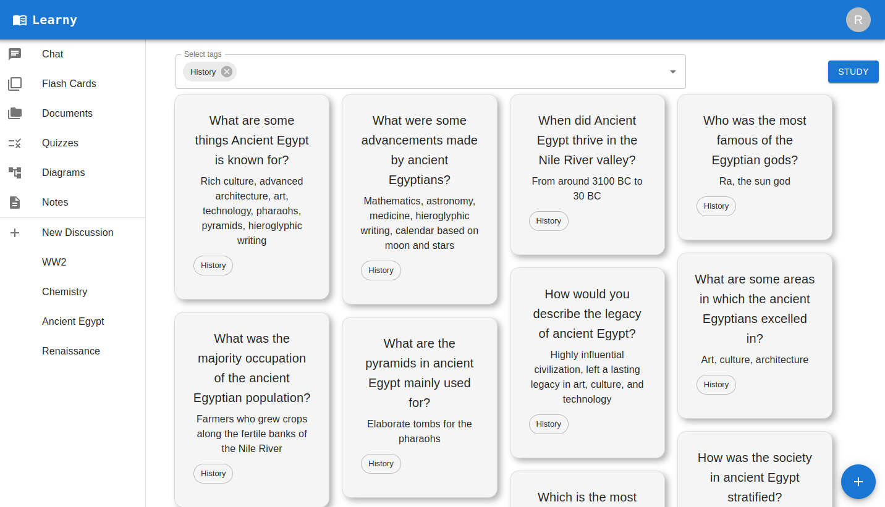

<h1 align="center"> Learny </h1>
<p align="center">
  <a href="https://gitpoint.co/">
    
  </a>
</p>

<p align="center">
  AI Tutor, curiosity engine, flashcards and quiz generator
</p>


## 🚀 How to run
```
docker pull mpvoss:learny
docker pull mpvoss:learny
```


##  🌟 Introduction

Language models are vast oceans of knowledge, and Learny is your compass. Spark curiosity, visualize with concept maps, build mastery with spaced repition flash cards, measure progress with quizzes. 

<p align="center">
  
</p>
<p align="center">
<i>Chat interface packed with AI features</i>
</p>

## 🎯 Mission

Knowledge is power, and LLM's have harnessed the information of the world like never before. 

Learny fully integrates that access to information into the learning process so everyone in the world can have a world class tutor.


## 🎬 Demo Video
asdf


## ⚙️ Features 

Seeing how concepts fit together, making study materials and practicing has never been easier.
- **Curiosity Engine:** Auto-generate questions that probe deep and unveiling insights to expand your knowledge
- **Concept Maps:** Outline the breadth of a topic in one click and see the whole picture
- **Flash Cards:** Instantly transform any AI response into flashcards with just a few clicks
- **Spaced Repition Study:** Master new material effectively using SuperMemo spaced repetition algorithms
- **Quizzes:** Evaluate your understanding and track your progress with auto-generated quizzes 
- **Timeline Generation:** Visualize historical events with auto-generated timelines
- **RAG:** Upload your own documents and utilizing all our powerful features on your own knowledge base


<p align="center">
  
</p>
<p align="center">
<i>Flashcards organized by tagging</i>
</p>

## 🛣️ Roadmap
- ~~Dockerize project~~  
- Quizzes
- ANKI flashcard import/export


##  📝 Feedback

Feel free to get in touch by [filing an issue](https://github.com/mpvoss/learny/issues/new). Feature requests are always welcome!
